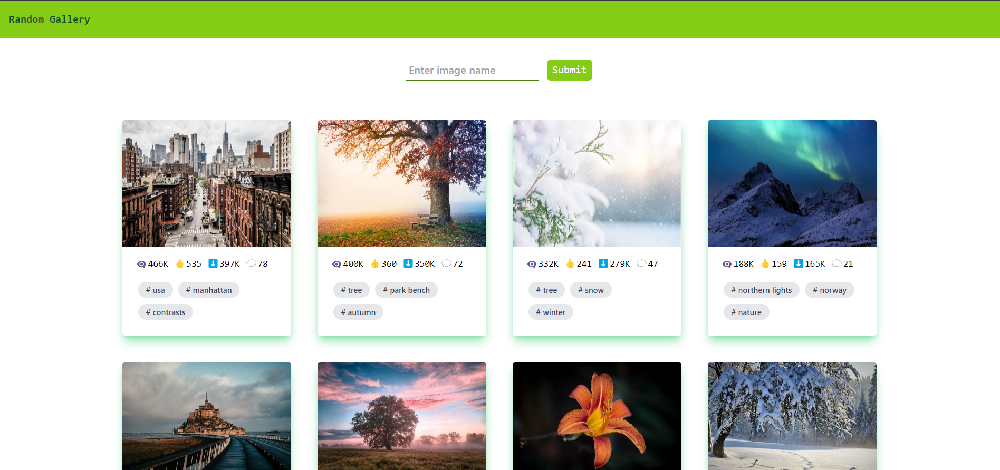

# Random Gallery (Using PIXABAY API)

A simple collection of images from Pixabay API

## Screenshots

<p> 
     
</p>

## Tech Stack

**Frontend** - React

**State Managment** - React Hooks

**Responsive Design** - Tailwind CSS

**Backend** - Pixabay API (To fetch data of the images)

## Environment Variables

To run this project, you will need to add the following environment variables to your .env file

`REACT_APP_PIXABAY_API` 

Pixabay API key - [Click Here](https://pixabay.com/api/docs/)

## Run Locally

Clone the project

```bash
  git clone https://github.com/Geyanth08/Random_Gallery.git
```

Go to the project directory

```bash
  cd my-project
```

Install dependencies

```bash
  npm install
```

Start the server

```bash
  npm run start
```
